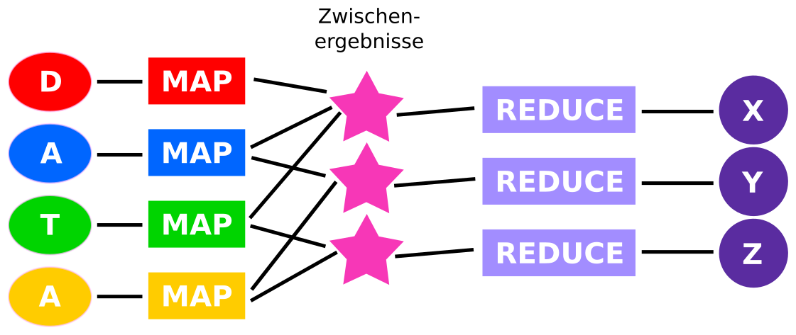

# Umsetzung
Der nun konzipierte Aufbau lässt sich sehr gut in einzelne Teilprobleme unterteilen, was ich bei meiner Umsetzung auch sehr strikt beachtet habe. Hierbei ist es am einfachsten, den Datenfluss von den verschiedenen Nachrichtenquellen zur fertigen Visualisierung zu betrachten. In den nachfolgenden Abschnitten wird dieser Verarbeitungsprozess beschrieben. Die einzelnen Schritte sind teilweise eher schwierig zu verstehen, da ihr Sinn wenig greifbar ist. Dies liegt daran, das viele verschiedene Repäsentationen und Strukturen von Daten ineinander umgewandelt werden müssen.

## Daten sammeln
Als erstes müssen Daten zur weiteren Verwertung von den verschiedenen Nachrichtenquellen gesammelt werden. Dies geschieht über die sogenannten "RSS-Feeds". Bei diesen handelt es sich um ein standardisiertes Format, über das Nachrichtenanbieter ihre Artikel, inklusive Metadaten wie z.B. den Zeitpunkt der Veröffentlichung, in maschinenlesbarer Form bereitstellen. Im Prinzip sind also die gleichen Daten wie auf der normalen Internetseite abrufbar, mit dem Unterschied, dass diese einfacher mit Hilfe von Programmen verarbeitet werden können (Siehe Abb. @fig:hr und @fig:rss).

{#fig:hr}

{#fig:rss}

Diese Darstellung als RSS-Feed @rss ermöglicht es, die Artikel verschiedener Online-Zeitungen zu betrachten, ohne für jede Zeitung einen komplett neuen Datensammler programmieren zu müssen.

Der Datensammelprogramm ist eine Software, welche ich in Python geschrieben habe. Python ist eine Programmiersprache, die auf Einfachheit und Flexibilität optimiert ist @python. Das Datensammelprogramm lädt sich den RSS-Feed einer einzelnen Nachrichtenquelle periodisch herunter und verarbeitet ihn weiter. Ich habe mich dazu entschieden, jeden RSS-Feed einmal pro Minute neu zu analysieren. Im ersten Schritt der Verarbeitung lädt das Programm den Feed als Datei von den Servern der jeweiligen Online-Zeitung herunter. Diese Datei ist eine sogenannte XML-Datei. In ihr werden Daten als Baumstruktur abgebildet.   Hierbei muss man sich die Datei als "Stamm" des Baums vorstellen. Die ersten "Äste" der Baumstruktur beinhalten die Metadaten, wie z.B. den Erstellungszeitpunkt und den Herausgeber des Feeds. Die nachfolgenden "Äste" enthalten jeweils einen Artikel. Diese Artikel wiederum beinhalten verschiedene Unterelemente, d.h. die "Äste" verzweigen sich in weitere, kleinere "Ästchen". In diesen stehen nun z.B. Autor, Titel, oder eine Kurzfassung des Textes. Außerdem ist ein Link zur Vollversion des Artikels gegeben. Diese textuelle Repräsentation einer Baumstruktur gilt es nun in eine einfacher verwendbare Repräsentation im Speicher des Python Programms umzuwandeln, also zu "parsen". Das Wort "parsen" ist sehr schwierig ins Deutsche zu übersetzen. Es beschreibt den Sachverhalt, die textuelle Repräsentation eines strukturierten Datensatzes in die "native" Repräsentation einer Programmiersprache für diesen Datensatz zu bringen. Die "native" Repräsentation eines Datensatzes in einer Programmiersprache ist die Standardform, diesen Datensatz abzubilden. Diese hat oft bestimmte Funktionen, die das Programmieren vereinfachen, wie z.B. die Zugriffsmöglichkeit auf einzelne Elemente bei Listen. Hierfür wird eine Programmbiliothek verwendet, die einen sogenannten "XML-Parser" beinhaltet, der genau dies erreicht. Nach diesem Schritt können die einzelnen Artikel betrachtet werden. Hierbei wird zuallererst überprüft, welche Artikel schon einmal verarbeitet wurden. Diese werden verworfen. Die übriggebliebenen, also neuen Artikel werden in eine allgemeinere Repräsentation für Neuigkeiten und ihre Metadaten gebracht, die ich mir überlegt habe. Diese ist auch wieder eine Baumstruktur und sieht aus wie in Abb. @fig:ir.

{#fig:ir}

Diese Umwandlung ist nötig, da der RSS-Standard zwar die grobe Struktur und ihre Repräsentation als XML-Datei spezifiziert, letzten Endes jeder Nachichtenanbieter allerdings doch nicht ganz kompatible Feeds ausliefert. Diese kleinen Unterschiede werden hier also angeglichen, damit die weitere Verarbeitung leichter vonstatten gehen kann, und in der weiteren Verarbeitung keine Unterschiede mehr beachtet werden müssen.

Ein weiteres Problem der RSS-Feeds ist, dass sie nur Kurzfassungen der Artikel enthalten. In der Umwandlung müssen also noch die vollständigen Artikel von der Internetseite des Nachrichtenanbieters heruntergeladen und der Volltext aus dieser extrahiert werden. Hierzu wird zuerst das HTML-Dokument der Seite "geparsed". Aus dem "geparsten" HTML-Dokument werden nun die relevanten Teile, zu denen z.B. nicht die Kopf- oder Fußzeile gehören, mithilfe sogenannter "CSS-Selektoren" identifiziert. Hiernach werden alle HTML-Elemente dieser Bereiche in reinen Text umgewandelt.

Architektonisch ist der Datensammler ein Programm, in das weitere kleinere Module "hereingesteckt" werden, die die einzelnen Nachrichtenseiten ansprechen (Siehe Abb. @fig:modules).

{#fig:modules}

Am Ende der Datenaquirierung werden die gesammelten Daten an die nächste Stufe weitergegeben, in der die Daten gespeichert werden.

## Speicherung
Die nun gesammelten Daten müssen vor der weiteren Verwendung ersteinmal strukturiert zwischenggespeichert werden. Dies geschieht in einer Datenbank. Ich habe mich dafür entschieden, eine sogenannte "NoSQL-Datenbank" zu verwenden, da diese flexiblere Abfragemethoden ermöglichen. \todo{cite} "NoSQL" steht hierbei dafür, dass die Datenbank nicht über die Datenbanksprache SQL angesprochen wird, wie es normalerweise der Fall ist, sondern eine andere Abfragemöglichkeit bietet. Relativ früh habe ich mich dafür entschieden, dass ich meine Datenbankabfragen als "MapReduce"-Funktionen formulieren möchte.

## MapReduce
Das MapReduce-Verfahren hat einige große Stärken, wie z.B. die hohe Parallelisierbarkeit und die damit verbundene hohe Geschwindigkeit, bei gleichzeitig hoher Flexibilität. MapReduce ist ein von der Firma Google eingeführtes Programmiermodell @map_google, welches wie folgt funktioniert (Vgl. Abb. @fig:mapreduce):

{#fig:mapreduce}

1. Am Anfang des Prozesses steht eine Menge aus $n$ Eingangsdatensätzen. In meinem Fall sind das die Zeitungsartikel, die als Objekte mit der oben beschriebenen Datenstruktur vorliegen. Für jeden dieser Artikel wird jetzt die Map-Funktion ausgeführt. Diese ordnet jedem Artikel $n$ Schlüssel-Wert-Paare zu. In dem Fall, dass wir zu jedem vorkommenden Wort die Häufigkeit bestimmen wollen, ordnet die Map-Funktion also jedem Artikel die Menge der darin enthaltenen Wörter zu. Da diese Funktion auf jeden Artikel angewandt wird, kann man sich in diesem Fall den gesammten Map-Prozess als eine Funktion vorstellen, die die Menge aller Artikel der Menge der darin enthaltenen Worte zuordnet. Der hierzu zugehörige Code dieser Map-Funktion ist:
```javascript
function map() {
      var text = this.text.replace(/[^A-Za-zÄäÖöÜüß ]/g, " ");   // entferne alle überfüssigen Satzzeichen, wie .,?!-
      var words = text.split(" ");   // Teile den text in Wörter
      for (var i = 0; i < words.length; i++) {   // für jedes Wort
            var word = words[i];
            if(word) {
               emit(word, 1);   // füge der Ausgabemenge das Wort hinzu
            }
      }
}
```

2. Im nächsten Schritt werden Elemente mit gleichen Schlüsseln gruppiert. Nach diesem Schritt liegt also eine Menge aus Schlüssel-Wertmengenpaaren vor (Auch wenn ich immer wieder das Wort Menge verwende, meine ich eigentlich Multimengen, da es relevent ist, wie oft ein bestimmtes Element in der Menge vorkommt @multimenge). Dieser Schritt ist, anders als die anderen beiden Schritte, bei allen anderen Abfragen gleich. Da in unserem Beispiel das Wort als Schlüssel verwendet wurde, sähe eine beispielhafte Menge nach diesem Schritt wie folgt aus, was stark an eine Strichliste erinnert:
```javascript
[
   "der": {1; 1; 1; 1; 1; 1; 1; 1; 1},
   "die": {1; 1; 1; 1},
   ...
]
```
3. Im dritten und letzten Schritt wird für jeden Schlüssel die sogenannte Reduce-Funktion angewandt. Diese reduziert die Mengen, die den Schlüsseln zugeordnet sind, auf einen Wert. In unserem Beispiel fällt die Reduce-Funktion relativ einfach aus, da sie nur die Elemente der Menge aufsummieren muss:
```javascript
reduce(key, values) {
      return values.reduce((previousValue, currentValue) => currentValue + previousValue);
}
```
4. Der vierte und letzte Schritt gehört eigentlich nicht mehr zum MapReduce-Verfahren. Dieser wird nach dem MapReduce-Verfahren ausgeführt und dient dazu, die Ergebnisse zu sortieren und eventuell Feinheiten zu verbessern. So ist es zum Beispiel möglich, selten genutzte Worte oder sogenannte Stoppworte in diesem Schritt auszusortieren. Stoppworte sind häufig auftetende Worte, die keine Relevanz für die Erfassung des Dokumenteninhaltes haben. Hierfür verwende ich verschiedene Stoppwortlisten, die von Sprachforschern erstellt worden sind, zusammen mit eigenen Ergänzungen. Der hierzu gehörige Code, der die Wortliste filtert, sieht wie folgt aus:
```javascript
function filter(data) {
      return data.filter(word => stopwords.indexOf(word["_id"].toLowerCase()) < 0)
}
```
Des weiteren wird in diesem Schritt versucht, Wörter mit dem gleichen Stamm, und somit mit der gleichen Bedeutung zusammenzuführen, auch wenn diese unterschiedliche Endungen haben. Ein Beispiel hierfür ist, dass die Wörter "Trump" und "Trumps" zusammengezählt werden. Hierbei wird immer das kürzeste Wort behalten, da dies meist die Grundform ist. Der Code hierfür ist nicht ganz so einfach:
```javascript
function word_merge(list) {
    modList = list.slice();
    modList.forEach((nowItem, nowCount, nowObject) => {
        var regex = new RegExp("^" + nowItem["_id"].toLowerCase() + '.{0,2}','g');
        nowObject.forEach((item, index, object) => {
            if(nowItem["_id"].toLowerCase() == item["_id"].toLowerCase()) return;
            checkWord = item["_id"].toLowerCase();
            if(checkWord.match(regex)) {
                nowObject[nowCount]["value"] += item["value"];
                object.splice(index, 1);
            }
        });
    });
    return modList
}
```

## Datenbank
Nachdem klar war, wie die Abfragen formuliert werden sollten, habe ich verschiedene Datenbanken in Betracht gezogen. Zuerst habe ich angefangen, mit der Datenbank "MongoDB" zu arbeiten, störte mich aber sehr stark an deren Komplexität. Außerdem bietet MongoDB keine Möglichkeit, diese über das HTTP-Protokoll anzusprechen, was für die Visualisierung allerdings sehr wichtig ist. Also sah ich mich nach anderen Alternativen um und fand "CouchDB", welche vom Apache-Projekt entwickelt wird. Diese Datenbank erfüllte die meisten meiner Anforderungen relativ gut, weshalb ich meinen gesamten, bis dahin existierenden Code an CouchDB anpasste. Nach einiger Zeit des Testens stellte sich allerdings heraus, das CouchDB wahrscheinlich zu langsam sein würde und ein unpassendes Rechteverwaltungssystem mitbringt, was die Arbeitsersparnis im Gegensatz zu MongoDB zunichte machen würde. In Folge dieser Erkentnis entschied ich mich dazu, meine Software zurück auf MongoDB zu portieren und für diese eine HTTP-Schnittstelle zu entwickeln.

\todo{cite}

## Middleware
Diese HTTP-Schnittstelle ist gewissermaßen das Bindeglied zwischen der Datenbank und der Visualisierung, weshalb es im nachfolgenden "Middleware" genannt wird. Sie nimmt HTTP-Anfragen von der Visualisierung ("Frontend") entgegen, leitet diese an die Datenbank weiter und schickt die Antwort der Datenbank an das Frontend zurück. Insofern könnte man sie auch als Übersetzer zwischen verschiedenen Protokollen verstehen. Eine Übersetzung ist notwendig, da ich die Visualisierung im Webbrowser implementiert habe, und im Browser nur sehr wenige
Schnittstellen verfügbar sind. HTTP ist eine dieser wenigen Möglichkeiten und bietet sich an, da es verhältnismäßig einfach zu implementieren ist @http. Zusätzlich zu der übersetzung der mapreduce-Anfragen ermöglicht es die Middleware, verschiedene Filter zu setzen. Mit Hilfe von diesen können z.B. der Zeitraum oder die Auswahl der Zeitungen eingegrenzt werden. Diese Filter werden über einen HTTP-Cookie übertragen, der von einer speziellen Einstellungsseite gesetzt wird. Durch diese Funktion ist es möglich, den Ausgangsdatensatz einzugrenzen und so Vergleiche zwischen verschiedenen Zeitspannen oder Zeitungsgruppen anzustellen.

## Visualisierung
Ich habe mich entschieden, die Visualisierung im Browser umzusetzen. Dies lag hauptsächlich daran, dass ich bereits einige der verwendeten Technologien kannte, und somit die Einstiegshürde niedriger war. Außerdem gibt es für den Browser und die damit verbundenen Technologien bereits sehr gute Bibliotheken zur Datenvisualisierung, auf die ich für meine Arbeit zurückgreifen konnte. \todo{cite} Ein weiterer, nicht unwichtiger Punkt, ist die einfache Portabilität von Programmen, welche im Browser laufen: Sie können auf fast jedem Computer, unabhängig von Betriebssystem oder Prozessorarchitektur, innerhalb von Sekunden aufgerufen und ausgeführt werden.
\todo{javascript is the lang!}

Eines der Hauptziele bei der Konzeption und Entwicklung der gesamten Analysesoftware war die Flexibilität: Es sollte möglichst schnell und einfach möglich sein, verschiedene Analysen über den Datensatz durchzuführen. Dies bezog sich nicht nur auf vorgefertigte, bei der Entwicklung bedachte Analysen, sondern auch zukünftige Ansätze. So sollte es einfach möglich sein, eigene neue Analysen über den Datensatz durchzuführen. Dies führte zu der konzeptionellen Endscheidung, dass die Analyse durch den Quellcode des Visualisierungsmoduls vorgegeben sein sollte und alle anderen Zwischenschritte, wie die Middleware oder die Datenbank nur auf die Anfragen des Analysemodul hören sollten. Dies hat zur Folge, das ein großer Teil der Komplexität des Codes im Frontend liegt.

Jede Visualisierung fragt am Anfang die benötigten Daten bei der Middleware über MapReduce-Anfragen an. Die einzelnen Funktionen, die hierzu benötigt werden, werden also in dem Code der Visualisierung definiert und hängen davon ab, welche Daten aus dem Datensatz benötigt werden. Dieser Vorgang kann mehrere Male wiederholt werden, um verschiedene Informationen über verschiedene Aspekte des Datensatzes zu bekommen. Hiernach werden die nun vorliegenden Daten weiterverarbeitet. Sie können also gefiltert, sortiert oder miteinander verrechnet werden. Liegen die Daten nun in der gewünschten Form vor, kann die eigentliche Visualisierung beginnen.

Um die nun aufbereiteten Daten zu visualisieren, gibt es viele verschiedene Möglichkeiten. Ich habe mich dazu entschieden, die Softwarebibliothek "d3.js" zu verwenden, welche es ermöglicht, Verbindungen zwischen Datenmengen und Elementen im Browser herzustellen. Das Aussehen dieser Elemente kann nun mithilfe von gängigen Techniken, wie "CSS" angepasst werden. Für komplexere Visualisierungen werden auch andere Bibliotheken verwendet, um z.B. die einzelnen Positionen der Worte zu berechnen. Mehr zu den einzelnen Visualisierungen ist im Abschnitt "Die verschiedenen Visualisierungen" zu finden.
\todo{read; konkreter; bild}

## Zusammenführung
\todo{read}
Da die gesamte Software modular aufgebaut ist, besteht sie aus vielen kleinen Komponenten, die spezialisiert und alleine nicht sehr nützlich sind. Diese kleinen Komponenten nennt man in der Softwareentwicklung "Microservices". \todo{cite} Um aus diesen kleinen Microservices eine funktionierende Software zu erhalten, muss man diese jeweils in einer passenden Umgebung starten und richtig miteinander verbinden. Um dies zu bewerkstelligen, habe ich das Software-Paket "Docker" verwendet. Dieses erlaubt es zu allererst, die einzelnen Umgebungen für jeden Microservice zu beschreiben. Diese enthalten zum Beispiel die verschiedenen Programmbibliotheken, die ich in den einzelnen Teilen verwandt habe, oder einen Webserver, um den Visualisierungscode an den Webbrowser auszuliefern. Eine solche Umgebung mit allen darin enthaltenen Programmen nennt man "Container". Diese Container erstellt man immer auf der Basis eines anderen "Basiscontainers". Dies sorgt dafür, das man sich nicht immer um alles innerhalb eines Containers kümmern muss, also zum Beispiel nicht immer selber das Betriebssystem installieren muss, sondern nur noch die eigenen Komponenten hinzufügen muss. Dies geschieht automatisiert über eine Datei, die jedem Microservice beigefügt ist, dem sogenannten "Dockerfile". Auch ist es möglich komplett, vorgefertigte Container zu verwenden, was ich z.B. für die Datenbank nutze.

Die einzelnen Container, die nun die komplette Umgebung enthalten, die die jeweiligen Microservices zum laufen benötigen, müssen nun nur noch alle richtig verbunden werden. Dies geschieht mit einem Programm namens "Docker-compose". Diesem gibt man eine Datei, die den Zustand des gesamten gewünschten Systems beschreibt. Automatisiert wird aus diesem und allen Dockerfiles der Microservices dann genau das beschriebene System erstellt und gestartet. Die Datei, die dieses System abbildet, sieht wie folgt aus:
```yaml
version: '2'

services:
   data-collectors:
      build: data-collectors/
      links:
         - mongodb
   backend:
      build: backend/
      links:
         - mongodb

   frontend:
      build: frontend/
      links:
         - backend
      ports:
         - "80:80"

   mongodb:
      image: "mongo:latest"
```
Auch hier sieht man wieder sehr schön die Struktur und die Modularität der Software und ihre einzelnen Dienste.

Dieses System, das alle ständig laufenden Komponenten enthält, wird nun auf einem Server gestartet und ermöglicht es, sowohl den Code der Visualisierung als auch Auskünfte über den Datensatz zu bekommen.
