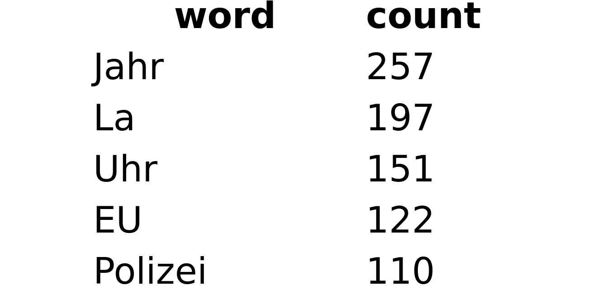
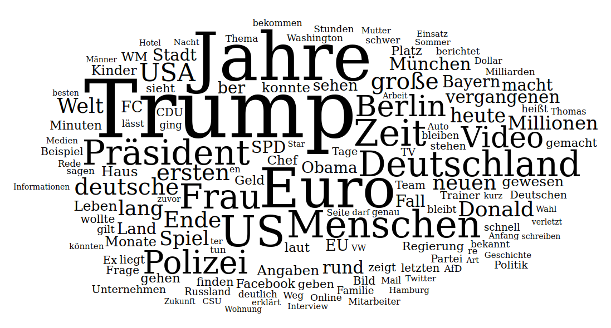
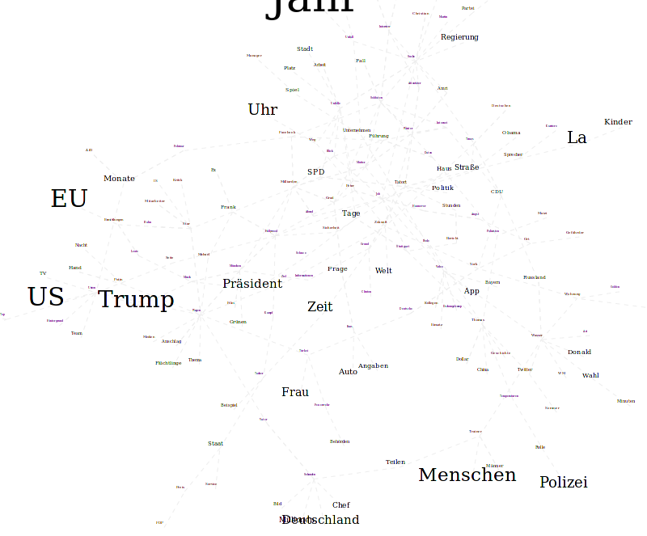
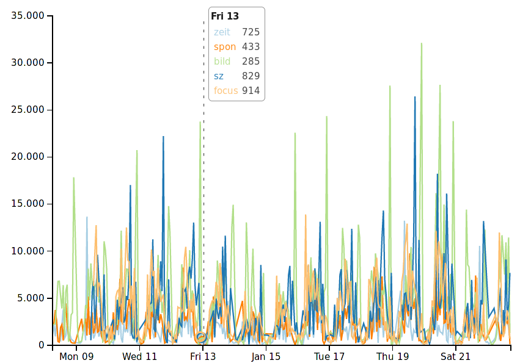
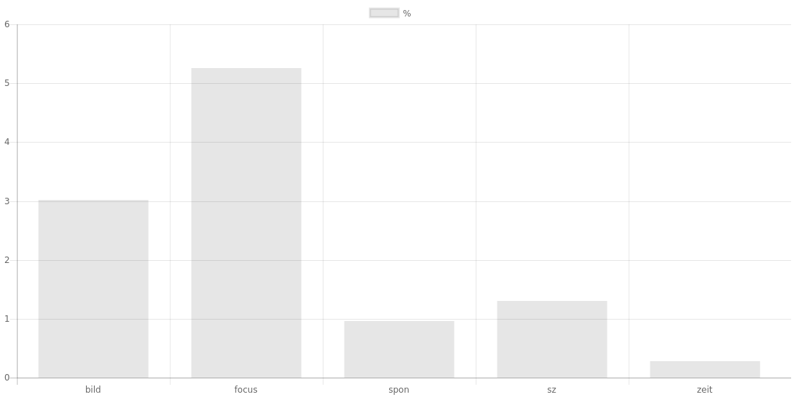

# Die verschiedenen Visualisierungen
Letzten Endes habe ich mich entschlossen, vier verschiedene Analysen zu implementieren. Diese geben verschiedene Informationen über den Datensatz aus und sind alle sehr unterschiedlich komplex. All diese sind jedoch nicht trivial, da immer versucht werden muss, aus einem Fließtext, also einem Format, mit dem Computer eigentlich nichts anfangen können Informationen zu gewinnen und zu veranschaulichen. Hierbei ist eine besondere Herausforderung, dass dies alles passieren muss, obwohl der Computer eigentlich über kein versändniss von "Sinn" verfügt. Aus diesem Grund müssen statistische Verfahren als Hilfsmittel zur Hand gezogen werden, die es dem Menschen, der die Daten letzten Endes interpretiert ermöglichen Informationen aus der Datenmenge zu ziehen.

## Häufigkeitstabelle
Die erste und einfachste Form der Visualisierung, die ich implementiert habe, ist die Häufigkeitstabelle (siehe Abb. @fig:table). Sie gibt an, wie häufig ein bestimmtes Wort verwandt wurde. Sie ist eigentlich noch keine Visualisierung im engeren sinne, da sie nur aus einer Tabelle besteht, und die Daten nicht ansprechend aufbereitet. Sie ist dennoch sehr praktisch um sich schnell einen groben überblick über den Datensatz zu verschaffen. Dies habe ich auch sehr exzessiv bei der Entwicklung von Algorithmen wie z.B. dem zum zusammenführen ähnlicher Worte genutzt. Der Code, der der Wortzählung zu Grunde liegt ist bereits im Abschnitt "MapReduce" gezeigt und erläutert worden. Auch ist es sehr wichtig, dass Stoppworte herausgefiltert werden, ein relevantes Ergebniss zu produzieren.

{#fig:table}

## Wortwolke
Die Grundidee meiner Halbjahresarbeit kam mir, als ich im Spiegel eine Wortwolke entdeckte. Diese Visualisierung, war also auch sehr naheliegend und konnte auf den gleichen Datensatz, wie die Häufigkeitstabelle zurückgreifen. Dieser wird nun nicht mehr als Tabelle ausgegeben, sondern als Wortwolke, in der öfter vorkommende Wörter Größer sind.

{#fig:cloud}

\todo{better images; search for specific events}

## Landkarte
Meine nächste Visualisierung sollte nun nicht nur die häufigkeit verwandter Wörter, sondern auch ihren Zusammenhang darstellen. Ich wollte also, dass Wörter, die öfter zusammen vorkommen näher beieinander stehen. Dies habe ich erreicht, indem ich zuerst, wie bei der Häufigkeitstabelle und der Wortwokle die Häufigsten wörter abgefragt habe. Danach habe ich eine zweite Abfrage geschrieben, die die Distanz der Häufigsten $n$ Wörter zueinander in den Artikeln feststellt.
```javascript
function map() {
    var givenWords = __marker__;
    var distance_function = __marker2__;
    var words = this.text.replace(/[^A-Za-zÄäÖöÜüß ]/g, " ").split(" ").filter(w => w);

    // create dict with {"word": ['o', 'c', 'c', 'u', 'r', 'e', 'n', 'c', 'e']}
    var wordOccurrences = {};
    givenWords.forEach(word => {
        var occurrences = [];
        for(var i = 0; i < words.length; i++) {
            if(word == words[i]) {
                occurrences.push(i);
            }
        }
        wordOccurrences[word] = occurrences;
    });

    givenWords.forEach(w => {
        givenWords.forEach(v => { // every word combination is covered as w and v
            if(w != v && wordOccurrences[w] && wordOccurrences[v]) {
                list = [];
                wordOccurrences[w].forEach(n => {
                    wordOccurrences[v].forEach(m => {
                        list.push(distance_function(n, m));
                    });
                });

                strength = list.reduce((a, b) => a + b, 0);
                if(strength != 0) {
                    arr = [w, v].sort();
                    emit(arr[0] + "." + arr[1], JSON.stringify([strength, 1]));
                }
            }
        });
    });
};
```

{#fig:map}

## Zeitreihe
Natürlich kann man sich in dem gesammelten Datensatz auch ganz andere Parameter angucken und muss sich nicht immer nur den Zustand zu einem Zeitpunkt betrachten. So ist es zum Beispiel möglich Aussagen über die veränderung verschiedener Parameter über die Zeit treffen. Genau dies habe ich nun also in meiner nächsten Visualisierung gemacht.

Zuerst habe ich nur die Anzahl der pro stunde veröffentlichten wörter über die Zeit betrachtet (siehe Abb. @fig:time).

{#fig:time}

## Vergleich verschiedener Zeitungen

Als letztes habe ich noch eine relativ einfache Analysemöglichkeit gebaut, die es ermöglicht, verschiedene Zeitungen zu vergleichen. Aus dieser bekommt man die Information in wie vielen


