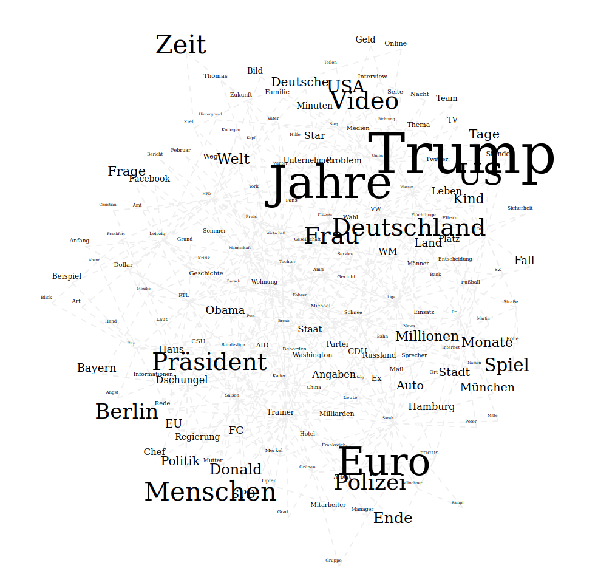

# Die verschiedenen Visualisierungen
Letzten Endes habe ich mich entschlossen, fünf verschiedene Analysen zu implementieren. Diese veranschaulichen verschiedene Informationen über den Datensatz und sind alle sehr unterschiedlich komplex. All diese sind jedoch nicht trivial, da immer versucht werden muss, aus einem Fließtext, also einem Format, mit dem Computer eigentlich nichts anfangen können, Informationen zu gewinnen und zu veranschaulichen. Hierbei ist eine besondere Herausforderung, dass dies alles passieren muss, obwohl der Computer eigentlich über kein Verständnis von "Sinn" verfügt. Aus diesem Grund müssen statistische Verfahren als Hilfsmittel zur Hand genommen werden, die es dem Menschen, der die Daten letzten Endes interpretiert, ermöglichen, Informationen aus der Datenmenge zu ziehen.

Im nachfolgenden sind die verschiedenen Visualisierungen erklärt und es werden beispielhafte Analysen gezeigt.

## Häufigkeitstabelle
Die erste und einfachste Form der Visualisierung, die ich implementiert habe, ist die Häufigkeitstabelle (siehe Abb. @fig:table). Sie gibt an, wie häufig ein bestimmtes Wort im Datensatz verwandt wurde. Sie ist eigentlich noch keine Visualisierung im engeren Sinne, da sie nur aus einer Tabelle besteht, und die Daten nicht ansprechend aufbereitet. Sie ist dennoch sehr praktisch, um sich schnell einen groben Überblick über den Datensatz zu verschaffen. Dies habe ich auch sehr exzessiv bei der Entwicklung von Algorithmen wie z.B. dem zum Zusammenführen ähnlicher Worte genutzt. Der Code, der der Wortzählung zu Grunde liegt, ist bereits im Abschnitt "MapReduce" gezeigt und erläutert worden. Auch ist es sehr wichtig, dass Stoppworte herausgefiltert werden, um ein relevantes Ergebnis zu produzieren.

{#fig:table height=3cm}

## Wortwolke
Die Grundidee meiner Halbjahresarbeit kam mir, als ich im Spiegel eine Wortwolke entdeckte. Diese Visualisierung war also auch sehr naheliegend und konnte auf den gleichen Datensatz wie die Häufigkeitstabelle zurückgreifen. Dieser wird nun nicht mehr als Tabelle ausgegeben, sondern als Wortwolke, in der öfter vorkommende Wörter größer dargestellt werden. Diese Form der Visualisierung gibt auf intuitive Art und Weise sehr schnell einen groben Überblick über die verwandten Worte und so über die wahrscheinlich gerade relevanten Themen (siehe z.B. Abb. @fig:cloud).

{#fig:cloud}

## Landkarte
Meine nächste Visualisierung sollte nun nicht nur die Häufigkeit verwandter Wörter, sondern auch ihren Zusammenhang darstellen. Ich wollte also, dass Wörter, die öfter zusammen vorkommen in der Visualisierung näher beieinander stehen. Dies habe ich erreicht, indem ich zuerst, wie bei der Häufigkeitstabelle und der Wortwolke die häufigsten Wörter abgefragt habe. Danach habe ich eine zweite Abfrage geschrieben, die die "Distanz" der häufigsten $n$ Wörter zueinander in den Artikeln feststellt. Diese sieht wie folgt aus:
```javascript
function map() {
    var givenWords = __liste_der_häufigsten_n_wörter__;
    var words = this.text.replace(/[^A-Za-zÄäÖöÜüß ]/g, " ").split(" ").filter(w => w);

    // erstellt eine Liste, die jedes Wort zu den Positionen des Vorkommens zuordnet
    var wordOccurrences = {};
    givenWords.forEach(word => {
        var occurrences = [];
        for(var i = 0; i < words.length; i++) {
            if(word == words[i]) {
                occurrences.push(i);
            }
        }
        wordOccurrences[word] = occurrences;
    });

    // Iteriere über jede Wortkombination
    givenWords.forEach(w => {
        givenWords.forEach(v => {
            if(w != v && wordOccurrences[w] && wordOccurrences[v]) {
                list = [];

                // Iteriere über jede Kombination der Vorkommen jeder Wortkombination
                wordOccurrences[w].forEach(n => {
                    wordOccurrences[v].forEach(m => {
                        // berechne die "Distanz"
                        list.push(1.0 / Math.pow(Math.abs(m - n), 0.001));
                    });
                });

                // Gebe die errechnete "Distanz" zurück
                strength = list.reduce((a, b) => a + b, 0);
                if(strength != 0) {
                    arr = [w, v].sort();
                    emit(arr[0] + "." + arr[1], JSON.stringify([strength, 1]));
                }
            }
        });
    });
};
```

Hierbei ist zu beachten, dass diese, anders als die anderen Abfragen, nicht statisch ist, sondern von der Liste der häufigsten Wörter als Eingabeparameter abhängt. Eingabeparameter beginnen und enden mit zwei Unterstrichen und werden vor dem Versenden der Anfrage durch die entsprechenden Werte ausgetauscht.

{#fig:map}

Ein einfaches Beispiel für die Anwendung dieser Visualisierung ist die Analyse des gesamten Datensatzes, wie sie in Abb. @fig:map zu sehen ist. Auf dieser Abbildung sind schon sehr schön einfache Strukturen, wie z.B. die Nähe zwischen den Worten "Trump" und "US" zu erkennen. Interessanterweise scheinen die Worte "Donald" und "Trump" nicht sehr häufig zusammen vorzukommen. Dies könnte z.B. daran liegen, das sie austauschbar verwendet werden können und so nicht immer zusammenstehen.

## Zeitreihe
Natürlich kann man sich in dem gesammelten Datensatz auch ganz andere Parameter angucken und muss nicht immer nur den Zustand zu einem Zeitpunkt betrachten. So ist es zum Beispiel möglich, Aussagen über die Veränderung verschiedener Parameter über die Zeit treffen. Genau dies habe ich nun also in meiner nächsten Visualisierung gemacht.

Zuerst habe ich nur die Anzahl der pro Stunde veröffentlichten Wörter über die Zeit betrachtet (siehe Abb. @fig:time). Hierbei sind sehr deutlich die Arbeitszeiten der Redakteure und die Wochenenden zu erkennen.

{#fig:time height=50%}

Als nächstes habe ich mir verschiedene spezifische Begriffe in ihrer Populatität über die Zeit angeschaut. Hierzu habe ich zunächst die Basiszeiteinheit von einer Stunde auf einen Tag heraufgesetzt, um das Rauschen der Daten zu verringern. D.h. nun werden also alle Artikel von einem Tag zusammengeworfen um einen Datenpunkt zu bilden.

Mithilfe der neuen Analysemöglichkeit habe ich nun die Amtseinführung von Donald Trump betrachtet (Abb. @fig:peak_trump). Hierbei ist sehr schön zu sehen, wie die Nennung des Wortes "Trump" am Tage seiner Amtseinführung ein Allzeithoch hat - zumindest bei der Bild-Zeitung. Hieraus können wir schließen, dass die Bild-Online Redaktion sehr flexibel aufgebaut ist und ihre Redakteure weniger stark an ihr Ressort gebunden sind, als die der anderen Zeitungen. Dies sorgt dafür, dass schneller und intensiver auf aktuelle Themen reagiert werden kann, worunter vielleicht aber auch die journalistische Qualität durch weniger fachliche Kompetenz des einzelnen Journalisten leidet.

{#fig:peak_trump height=50%}

## Vergleich verschiedener Zeitungen

Als letztes habe ich noch eine relativ einfache Analysemöglichkeit gebaut, die es ermöglicht, verschiedene Zeitungen zu vergleichen. Aus dieser bekommt man die Information, wie oft in einer bestimmten Zeitung ein bestimmtes Wort vorkommt. Hierbei muss man, um eine Vergleichbarkeit gewährleisten zu können, eine relative Häufigkeit betrachten, da die Veröffentlichungsmengen der verschiedenen Zeitungen sehr unterschiedlich groß sind (Siehe Abb. @fig:time). Um diese relative Häufigkeit zu errechnen, kann man zwei Ansätze verfolgen:
1. Wie viel Prozent der Wörter entsprechen dem gesuchten Wort?
2. Wie viel Prozent der Artikel enthalten das gesuchte Wort?

In Abb. @ref:dschungel ist zu sehen, welche Zeitung wie viel über das Dschungelcamp berichtet. Hierbei ist die zweite Darstellungsweise gewählt worden, da diese sehr viel intuitiver greifbar ist. Das Ergebnis dieser Analyse war für mich sehr unerwartet, besonders, weil die Bild-Zeitung die Rangfolge nicht anführt. Stattdessen ist zu beobachten, dass der Focus mehr Interesse an dem Dschungelcamp zeigt, obwohl man ihn in einem intellektuell höheren Millieu verorten würde.

{#fig:dschungel}
