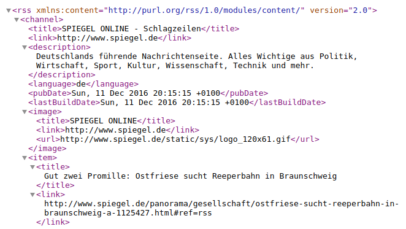
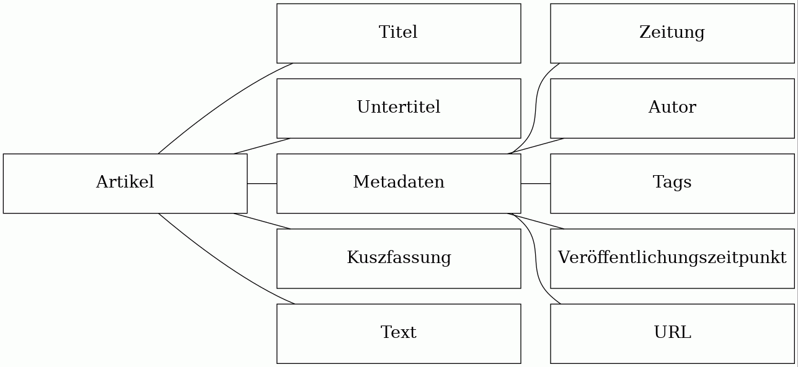

# Idee
Am Anfang dieser Halbjahresarbeit stand die Idee, die aktuelle Nachrichtenlage einfach sichtbar zu machen.

# Umsezung
Die Umsetzung lässt sich sehr gut in einzelne teilprobleme Unterteilen. Hierbei ist es am einfachsten, den Datenfluss von den Verschiedenen Nachrichtenquellen zur fertigen Visualisierung zu betrachten. In den nachfolgenden Abschnitten wird dieser Verarbeitungsprozess beschrieben.

## Daten Sammeln
Als erstes müssen Daten zur weiteren Verwertung von den Verschiedenen Nachrichtenquelln Gesammelt werden. Dies geschieht über die sogenannten "RSS-Feeds". Bei diesen handelt es sich um ein standartiesiertes Format, über das Nachrichtenanbieter ihre Artikel, inklusive Metadaten wie z.B. den Zeitpunkt der Veröffentlichung, in maschienenlesabrer Form bereitstellen. Im Prinzip werden also die Gleichen Daten bereitgestellt, wie auf der normalen Internetseite, mit dem Unterschied, das sie einfacher mit Programmen verarbeitbar sind.

{height=10cm}

{height=6cm}

Diese Darstellung als RSS-Feed ermöglicht es, die Artiel verscheidener Online-Zeitungen zu betrachten, ohne für jede einen komplett neuen Datensammler programmieren zu müssen.

Der Letztendliche Datensammler ist ein Programm, welches ich in Python geschriben habe. Es läd sich den RSS-Feed einer einzelnen Nachrichtenquelle periodisch herunter und verarbeitet ihn weiter. Aktuell wird jeder RSS-Feed alle 10s neu analysiert. Im ersten schritt der Verarbeitung lädt das Programm den Feed als Datei von den Servern der Jeweiligen Online-Zeitung herunter. Diese Datei ist eine sogenannte XML-Datei. In ihr werden Daten als Baumstruktur abgebildet.  Hierbei muss man sich die Datei als "Stamm" des baums vorstellen. Die ersten "Äste" der Baumstruktur beinhalten die metadaten, wie z.B. den Erstellungszeitpunkt und den herausgeber des Feeds. Die nachflogenden "Äste" enthalten jeweils einen Artikel. Diese Artikel wiederum beinhalten verscheidene unterelemente, d.h. die "Äste" verzweigen sich in weitere, kleinere "Ästchen". In diesen stehen nun z.B. der Author des Textes, der Titel, oder eben der eigentliche Inhalt des Textes. Diese Textuelle Repräsentation einer Baumstruktur gilt es nun zunächst in eine einfacher verwendbare native representation im Speicher des Python Programms umzuwandeln. Hierfür wird eine Programmbiliothek verwendet, die einen sogenannten XML-Parser beinhaltet. Nach diesem schritt können die Einzelnen Artikel betrachtet werden. Hierbei wird zu aller erst überprüft, welche Artikel schn einmal verarbeitet wurden. Diese werden Verworfen. Die übriggebliebenen, also neuen Artikel werden in eine Allgemeinere Repräsentation für Neuigkeiten und ihre Metadaten gebracht, die ich mir überlegt habe. Diese ist auch wieder eine Baumstruktur und sieht wie folgt aus:
{width=7cm}

Diese umwandlung ist nötig, da der RSS-Standart zwar die grobe Struktur und ihre repersentation als XML-Datei spezifiziert, letztenendes jeder Nachichtenanbiter allerdings doch nicht ganz Kompatible Feeds ausliefern. Diese Kleinen unterscheide werden Hier also angeglichen, damit die weitere Verarbeitung leichter von statten gehen kann, und keine unterschiede mehr beachtet werden müssen.

Am ende der Datenaquirierung werden die gesammelten Datan an die nächste stufe weitergegeben: Die Speicherung.

## Speicherung
Die nun gesammelten Daten müssen vor der weiteren verwendung ersteinmal strukturiert zwischenggespeichert werden. Dies geschieht in einer Datenbank. Ich habe mich dafür entschieden, eine sogenannte "noSQL-Datenbank" zu verwenden, da

# Stichpunkte
* Docker!!!1!
  * build + tests
* Klare Unterteilung:
  * Datensammler
    * In Python geschrieben
    * Crawlen hauptsächlich rss-feeds
  * MongoDB
    * noSQL-Datenbank
    * Map/Reduce-Querys
    * zuerst Mongo, dann Couch, dann Mongo
  * Http Middleware
    * stellt MongoDB über HTTP bereit
    * Clinets können eigene Map/Reduce Anfragen an die Datenbank stellen
      * - langsam
      * + flexibel
      * -> kleine datenmengen, daher ok
  * Frontend
    * 3d.js visualisierung
    * einfache API zur DB
    * einfache umstrukturierbarkeit

## Vorgehen
## Probleme
## Leztendliche Umsetzung

# Beobachtungen
## Evaluation des Verfahrens
## Verschiedene Zeitungen im Vergleich
# Fazit
